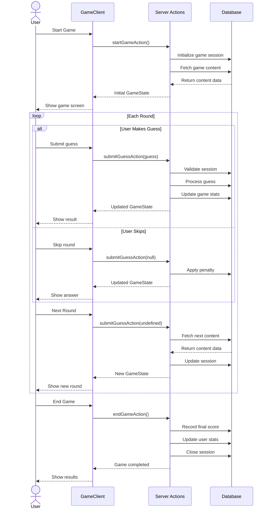

Client-Server-Database communication flow

```mermaid
sequenceDiagram
    actor User
    participant Client as GameClient
    participant Server as Server Actions
    participant DB as Database

    User->>Client: Start Game
    Client->>Server: startGameAction()
    Server->>DB: Initialize game session
    Server->>DB: Fetch game content
    DB-->>Server: Return content data
    Server-->>Client: Initial GameState
    Client-->>User: Show game screen

    loop Each Round
        alt User Makes Guess
            User->>Client: Submit guess
            Client->>Server: submitGuessAction(guess)
            Server->>DB: Validate session
            Server->>DB: Process guess
            Server->>DB: Update game stats
            Server-->>Client: Updated GameState
            Client-->>User: Show result
        else User Skips
            User->>Client: Skip round
            Client->>Server: submitGuessAction(null)
            Server->>DB: Apply penalty
            Server-->>Client: Updated GameState
            Client-->>User: Show answer
        end

        User->>Client: Next Round
        Client->>Server: submitGuessAction(undefined)
        Server->>DB: Fetch next content
        DB-->>Server: Return content data
        Server->>DB: Update session
        Server-->>Client: New GameState
        Client-->>User: Show new round
    end

    User->>Client: End Game
    Client->>Server: endGameAction()
    Server->>DB: Record final score
    Server->>DB: Update user stats
    Server->>DB: Close session
    Server-->>Client: Game completed
    Client-->>User: Show results
```
